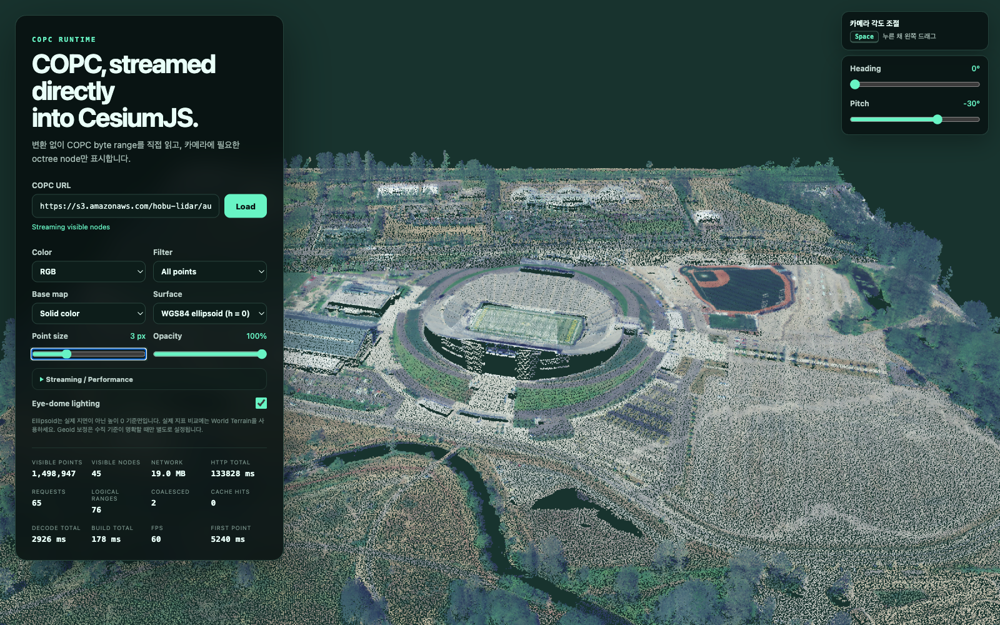
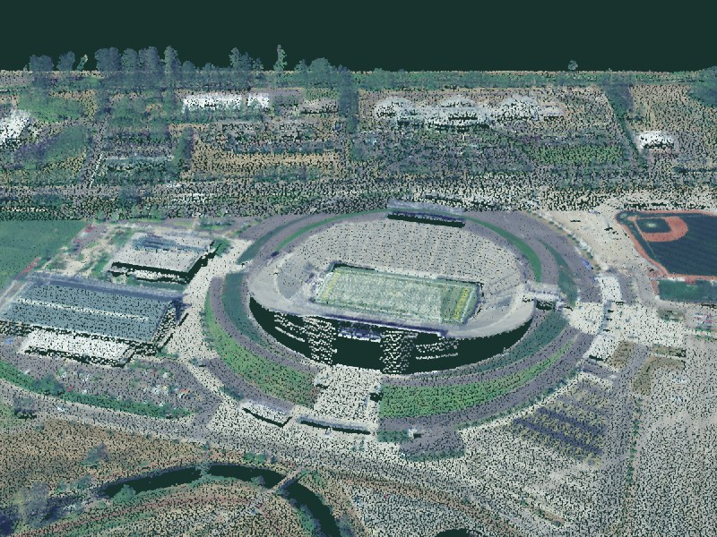
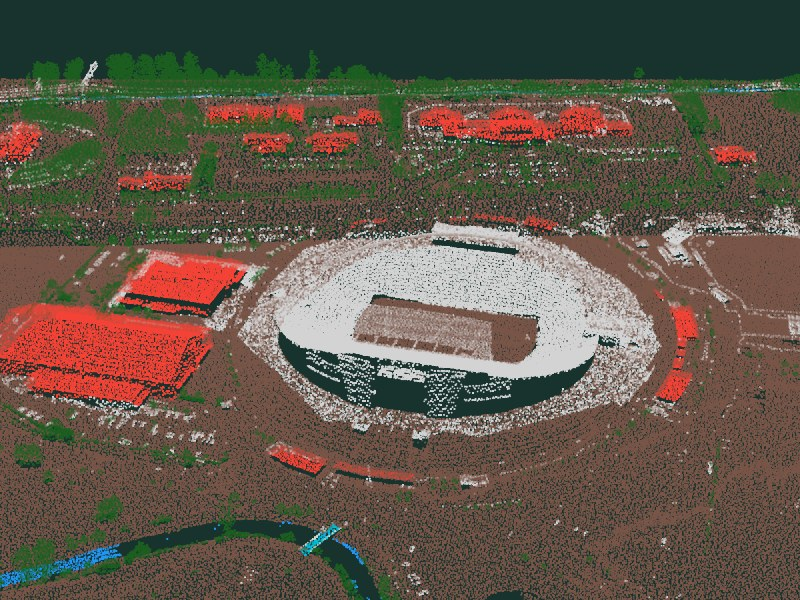
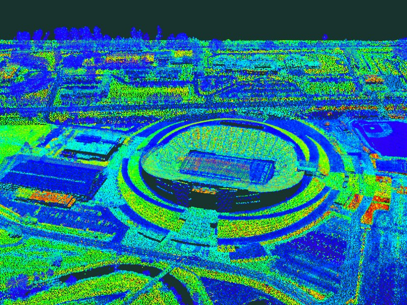
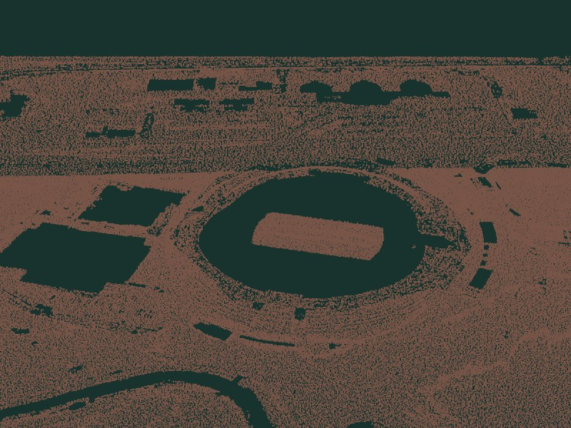
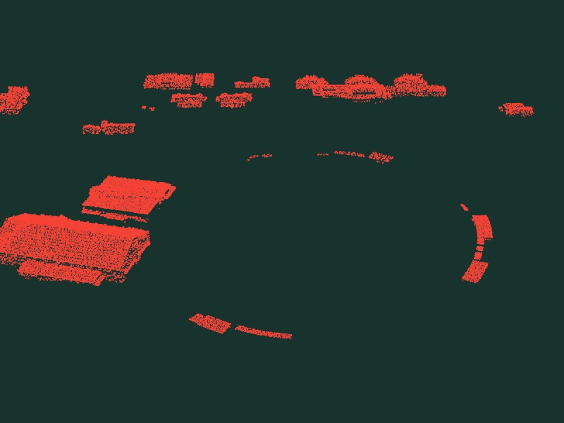
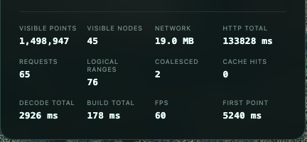
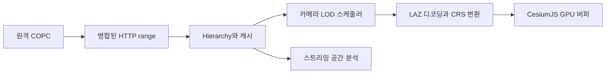

# CesiumJS COPC Runtime

3D Tiles 사전 변환 없이 COPC를 CesiumJS에서 직접 스트리밍하고 분석합니다.
전처리 단계도, 원본을 복제한 서비스용 사본도 필요하지 않습니다.

[](https://github.com/yangseungsang/cesiumjs-copc-runtime/actions/workflows/ci.yml)
[](https://www.npmjs.com/package/cesiumjs-copc)
[](https://yangseungsang.github.io/cesiumjs-copc-runtime/)
[](LICENSE)
[](package.json)

**[라이브 데모](https://yangseungsang.github.io/cesiumjs-copc-runtime/)** |
[English](README.md) |
[시작하기](docs/getting-started.md) |
[API 레퍼런스](docs/api-reference.md) |
[아키텍처](docs/architecture.md) |
[벤치마크](docs/benchmarks.md) |
[기여 가이드](CONTRIBUTING.md)



<p align="center">
  <em>
    공개 Autzen Stadium COPC(10,653,336 points, 77.4 MiB)를 Amazon S3에서 바로 열었습니다.
    위 화면은 octree node 45개에서 150만 포인트를 표시하며 전송량은 19 MB 입니다.
  </em>
</p>

> 이 프로젝트는 독립 오픈소스 프로젝트이며 Cesium의 공식 프로젝트가 아닙니다.

## 왜 필요한가

기존 포인트 클라우드 웹 서비스는 원본을 별도의 전달 형식으로 변환하는 경우가
많습니다. 그러면 전처리 시간이 들고, 저장소가 중복되고, 분석은 화면에 보이는 것과
다른 사본을 대상으로 돌아갑니다.

COPC는 이미 LAZ 포인트를 Range-addressable Octree로 저장하므로, 브라우저가 현재
카메라에 필요한 hierarchy page와 node chunk만 요청할 수 있습니다.

```text
기존 방식:  원본 포인트 클라우드  ->  전처리  ->  서비스용 사본  ->  뷰어
이 프로젝트:  COPC 파일 하나  ------- HTTP byte range ------>  CesiumJS
                                 \-----------------------> 스트리밍 분석
```

## 화면으로 보기

모든 포인트를 LAS attribute 기준으로 런타임에 색칠합니다. 모드를 바꿔도 이미 메모리에
올라온 포인트를 다시 칠할 뿐, 네트워크 재요청은 발생하지 않습니다.

|                               RGB                               |                                       Classification                                        |                                  Intensity                                  |
| :-------------------------------------------------------------: | :-----------------------------------------------------------------------------------------: | :-------------------------------------------------------------------------: |
|  |  |  |

Classification 필터로 원하는 면만 남길 수 있습니다. 필터는 디코딩된 포인트를 대상으로
동작하므로 지면과 건물이 같은 파일 하나에서 나옵니다.

|                                지면만                                |                                건물만                                |
| :------------------------------------------------------------------: | :------------------------------------------------------------------: |
|  |  |

모든 레이어는 실제로 수행한 작업을 그대로 보고합니다. 스트리밍 동작을 추측하지 않고
측정할 수 있습니다.



## 설치

```sh
npm install cesiumjs-copc
```

CesiumJS는 의존성으로 함께 설치됩니다. 공간 질의, 통계, 높이 프로파일이 필요할 때만
분석 패키지를 추가하세요.

```sh
npm install cesiumjs-copc-analysis
```

요구 사항은 빌드용 Node.js 20 이상, WebGL을 지원하는 브라우저, 그리고 CORS와 HTTP
`206 Partial Content`를 지원하는 COPC 서버입니다.

## 빠른 시작

```ts
import { Viewer } from "cesium";
import { CopcPointCloud } from "cesiumjs-copc";

const viewer = new Viewer("cesiumContainer");

const pointCloud = await CopcPointCloud.fromUrl(
  "https://s3.amazonaws.com/hobu-lidar/autzen-classified.copc.laz",
);

viewer.scene.primitives.add(pointCloud);
viewer.camera.flyToBoundingSphere(pointCloud.boundingSphere);
```

연동은 이것이 전부입니다. 레이어가 스스로 hierarchy를 읽고, 현재 카메라에 필요한
node를 고르고, Worker에서 LAZ를 디코딩하고, 화면을 움직이는 동안 계속 정밀도를
높입니다.

### 소스 먼저 확인하기

`fromUrl`은 서버가 정상 동작한다고 가정합니다. 처음 쓰는 URL이라면 먼저 확인하세요.

```ts
const diagnosis = await CopcPointCloud.validateUrl(url);
if (!diagnosis.supportsRanges) throw new Error("서버가 byte range를 지원하지 않습니다");
if (!diagnosis.copcValid) throw new Error(diagnosis.error ?? "유효한 COPC 파일이 아닙니다");
```

### 기본값 조정하기

기본값은 감지된 low, medium, high 기기 등급에 맞춰 정해지며 전부 덮어쓸 수 있습니다.

```ts
import { IndexedDbRangeCache } from "cesiumjs-copc-core";

const pointCloud = await CopcPointCloud.fromUrl(url, {
  maximumScreenSpaceError: 2, // 값이 낮을수록 더 높은 detail을 요청
  pointBudget: 2_000_000, // 동시에 표시할 포인트 상한
  pointSize: 2,
  colorBy: "rgb", // "rgb" | "classification" | "intensity" | "elevation"
  filter: { classifications: [2] }, // 지면만
  allowPicking: true,
  requestConcurrency: 8,
  sourceCrs: undefined, // 파일에 CRS WKT가 없을 때만 지정
  range: {
    persistentCache: IndexedDbRangeCache.supported
      ? new IndexedDbRangeCache({ maximumBytes: 512 * 1024 * 1024 })
      : undefined,
  },
});
```

`colorBy`, `filter`, `pointSize`, `opacity`, `pointBudget`,
`maximumScreenSpaceError`는 쓰기 가능한 속성이기도 합니다. 데모의 컨트롤도 로드 이후
값을 대입하는 것이 전부입니다.

전체 절차는 [시작하기](docs/getting-started.md), CRS와 geoid 처리는
[좌표계](docs/coordinate-systems.md), 소스가 정상 동작하지 않을 때는
[문제 해결](docs/troubleshooting.md)을 참고하세요.

## 스트리밍 분석

질의는 뷰어가 읽는 것과 같은 파일을 대상으로 원본 COPC CRS에서 수행됩니다. 결과는
비동기 스트림으로 도착하므로 전체를 먼저 메모리에 올릴 필요가 없습니다.

```ts
import { CopcSource } from "cesiumjs-copc-core";
import { computeStatistics, queryBounds } from "cesiumjs-copc-analysis";

const source = await CopcSource.fromUrl(url);
const nodes = queryBounds(source, [minX, minY, minZ, maxX, maxY, maxZ], {
  pointLimit: 2_000_000,
  dimensions: ["Intensity", "Classification"],
});

const statistics = await computeStatistics(nodes);
// { pointCount, height: { minimum, maximum, mean }, intensity, classifications }
```

같은 패키지의 `computeHeightProfile`로 단면 프로파일을 계산할 수 있습니다.

## 데모 실행

```sh
git clone https://github.com/yangseungsang/cesiumjs-copc-runtime.git
cd cesiumjs-copc-runtime
npm ci
npm run build
npm run demo
```

출력된 URL을 여세요. Autzen Stadium 데이터가 기본으로 로드되고, byte range를 지원하는
CORS 허용 COPC URL이면 무엇이든 넣을 수 있습니다. 위 스크린샷은 이 데모에서
`node scripts/capture-screenshots.mjs`로 캡처한 것입니다.

## 기능

**네트워킹**

- COPC header, VLR, hierarchy page를 HTTP `206` range로 지연 로딩
- 인접 range 병합과 압축, 디코딩, IndexedDB 캐시
- 카메라가 움직이면 진행 중인 요청을 취소하고 우선순위 재조정

**렌더링**

- 카메라 중심 우선순위와 point budget을 사용하는 additive screen space LOD
- transferable 기반 Worker LAZ 디코딩
- node 상대 ECEF `Float32` 렌더 좌표와 원본 `Float64` 좌표 동시 보존
- RGB, classification, intensity, elevation 색상과 필터, 불투명도, eye dome lighting
- low, medium, high 기기 등급과 덮어쓸 수 있는 budget

**공간 정보와 분석**

- WKT compound CRS 처리, 명시적 EGM96 보정, 주요 국내 EPSG 좌표계
- picking, GPS time과 Cesium Clock 연동, 공간 질의, 통계, 높이 프로파일

## 패키지

| 패키지                                             | 역할                                                    |
| -------------------------------------------------- | ------------------------------------------------------- |
| [`cesiumjs-copc`](packages/cesium-copc)            | CesiumJS 렌더링과 인터랙션을 담당하는 메인 패키지       |
| [`cesiumjs-copc-core`](packages/copc-core)         | COPC source, range reader, hierarchy, 캐시, 포인트 타입 |
| [`cesiumjs-copc-runtime`](packages/copc-runtime)   | LOD 선택, 요청 큐, 기기 등급, 메모리 캐시               |
| [`cesiumjs-copc-worker`](packages/copc-worker)     | 브라우저 Worker pool, LAZ 디코딩, 렌더 좌표 변환        |
| [`cesiumjs-copc-analysis`](packages/copc-analysis) | 영역 질의, 통계, 높이 프로파일                          |
| [`cesiumjs-copc-benchmark`](packages/benchmark)    | 재현 가능한 원격 스트리밍과 디코딩 벤치마크             |

대부분의 애플리케이션은 나머지를 함께 끌어오는 `cesiumjs-copc` 하나면 충분합니다.

## 아키텍처



네트워킹, 스케줄링, 디코딩, 렌더링, 분석을 별도 패키지로 분리해 각각 독립적으로
발전할 수 있게 했습니다. 설계 근거는 [아키텍처](docs/architecture.md)와
[ADR-0001](docs/adr/0001-native-copc-runtime.md)에 있습니다.

## 측정 결과

| 항목                 |                                                 결과 |
| -------------------- | ---------------------------------------------------: |
| Unit Test            |                               15개 파일, 58개 테스트 |
| 커버리지 기준선      | statements 50.95%, branches 74.01%, functions 81.04% |
| CI 런타임            |                                       Node.js 20, 22 |
| 브라우저 검증        |                                  Chromium smoke test |
| 기준 데이터          |                         10,653,336 points / 77.4 MiB |
| 기준 View 전송량     |                                           약 3.0 MiB |
| 디코딩한 포인트      |                        octree node 8개에서 269,241개 |
| 디코딩 처리량 중앙값 |                                   약 55,875 points/s |

이 수치는 특정 장비 한 대에서 얻은 관측값이며 일반화된 성능 주장이 아닙니다. 다른
환경과 비교하기 전에 [측정 방법](docs/benchmarks.md)을 먼저 확인하세요.

모든 Pull Request는 포매팅, 린트, 단위 테스트, 커버리지 기준, 타입 검사, 전체
워크스페이스 빌드, 패키지 dry run, Chromium smoke test를 통과해야 합니다.

```sh
npm run lint
npm run format:check
npm test
npm run test:coverage
npm run typecheck
npm run build
npm run demo:build
npm run test:e2e
```

## 프로젝트 상태

동작하는 `0.1.0` MVP 단계입니다. 알려진 한계는 다음과 같습니다.

- Cesium의 buffer point API가 아직 실험 단계입니다
- 색상과 필터 갱신이 런타임에 CPU에서 처리됩니다
- Geoid 보정이 명시적 설정으로만 동작합니다
- 장시간 브라우저 벤치마크가 아직 부족합니다

모두 [Issues](https://github.com/yangseungsang/cesiumjs-copc-runtime/issues)와
[로드맵](docs/roadmap.md)에서 공개 추적하고 있습니다.

## 기여

Pull Request를 열기 전에 [CONTRIBUTING.md](CONTRIBUTING.md)를 읽어 주세요. 버그,
기능, 성능 제보는 준비된 이슈 양식을 사용하면 됩니다. 보안 취약점으로 의심되는
내용은 [SECURITY.md](SECURITY.md)에 따라 비공개로 제보해야 합니다.

[MIT License](LICENSE)로 배포됩니다.
