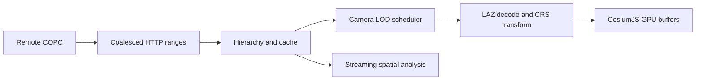

# CesiumJS COPC Runtime

Cloud-native COPC streaming and analysis for CesiumJS without 3D Tiles preprocessing.

[](https://github.com/yangseungsang/cesiumjs-copc-runtime/actions/workflows/ci.yml)
[](https://yangseungsang.github.io/cesiumjs-copc-runtime/)
[](LICENSE)
[](package.json)

[Live demo](https://yangseungsang.github.io/cesiumjs-copc-runtime/) |
[한국어](README.ko.md) |
[All documentation](docs/README.md) |
[Getting started](docs/getting-started.md) |
[Architecture](docs/architecture.md) |
[Benchmarks](docs/benchmarks.md) |
[Contributing](CONTRIBUTING.md)


CesiumJS COPC Runtime reads a COPC file through HTTP byte ranges, selects the octree
nodes required by the current camera, decodes LAZ data in Workers, and renders points
through CesiumJS GPU buffers. The same source coordinates and attributes remain
available for picking and streaming analysis.

> This is an independent open-source project and is not an official Cesium project.

## Why this project exists

Conventional web point-cloud pipelines often convert source data into a separate
delivery format. That adds preprocessing, duplicates storage, and separates analysis
from visualization. COPC already stores LAZ points in a range-addressable octree, so
the browser can request only the hierarchy pages and node chunks needed for a view.

```text
Conventional:  source point cloud → preprocessing → service copy → viewer
This project:  one COPC file ─────── HTTP byte ranges ────────→ CesiumJS
                                      └───────────────────────→ analysis
```

| Axis                            | 3D Tiles pipeline                      | This project |
| ------------------------------- | -------------------------------------- | ------------ |
| Work before the first view      | Convert the whole dataset              | None         |
| Cost when the source changes    | Reconvert the affected dataset         | None         |
| What the per-view cost scales with | The view, after conversion          | The view     |

[Pipeline comparison](docs/pipeline-comparison.md) works through each axis, separates
what this repository measured from what follows structurally, and is explicit that no
row measures an actual 3D Tiles conversion. It also lists the cases where converting
to 3D Tiles is still the better choice.

## Evidence at a glance

| Evidence                                 |                                       Current result |
| ---------------------------------------- | ---------------------------------------------------: |
| Automated unit tests                     |                             58 tests across 15 files |
| Coverage baseline                        | 50.95% statements, 74.01% branches, 81.04% functions |
| Supported CI runtimes                    |                                    Node.js 20 and 22 |
| Browser verification                     |                           Chromium viewer smoke test |
| Reference COPC                           |                         10,653,336 points / 77.4 MiB |
| Bytes transferred for the benchmark view |                                        about 3.0 MiB |
| Points decoded                           |                        269,241 across 8 octree nodes |
| Median decode throughput, three runs     |                                about 55,875 points/s |

See [the reproducible benchmark methodology](docs/benchmarks.md) before comparing
these numbers with another environment.

## Features

- COPC header, VLR, and hierarchy pages loaded lazily through HTTP `206` ranges
- nearby range coalescing plus compressed, decoded, and IndexedDB caches
- additive screen-space LOD with camera-centered priorities and point budgets
- cancellation and reprioritization when the camera changes
- transferable Worker-based LAZ decoding
- node-relative ECEF `Float32` render positions with source `Float64` coordinates
- WKT compound CRS handling, explicit EGM96 correction, and common Korean EPSG grids
- RGB, classification, intensity, and elevation coloring; filters, opacity, and EDL
- picking, GPS time–Cesium Clock binding, spatial queries, statistics, and profiles
- low, medium, and high device tiers with overridable budgets

## Architecture



The runtime is split into packages so networking, scheduling, decoding, rendering,
and analysis can evolve independently. See [Architecture](docs/architecture.md) and
[ADR-0001](docs/adr/0001-native-copc-runtime.md) for the design rationale.

## Packages

| Package                   | Role                                                         |
| ------------------------- | ------------------------------------------------------------ |
| `cesiumjs-copc`           | Main CesiumJS rendering and interaction package              |
| `cesiumjs-copc-core`      | COPC source, range reader, hierarchy, cache, and point types |
| `cesiumjs-copc-runtime`   | LOD selection, request queue, device tiers, and memory cache |
| `cesiumjs-copc-worker`    | Browser Worker pool, LAZ decode, and render coordinates      |
| `cesiumjs-copc-analysis`  | Bounds queries, statistics, and height profiles              |
| `cesiumjs-copc-benchmark` | Reproducible remote streaming and decode benchmark           |

## Install

Node.js 20 or newer is required.

```sh
npm install cesiumjs-copc cesium
```

CesiumJS is a peer dependency, so install it yourself and keep exactly one copy in
your tree. The renderer hands Cesium objects back and forth with your viewer, and two
Cesium instances break the type identity those exchanges rely on.

Install only what you use. The packages are independent:

```sh
npm install cesiumjs-copc-core       # read COPC over HTTP ranges, no renderer
npm install cesiumjs-copc-analysis   # spatial queries and statistics, no renderer
```

Neither of those needs Cesium.

## Run the demo from source

```sh
git clone https://github.com/yangseungsang/cesiumjs-copc-runtime.git
cd cesiumjs-copc-runtime
npm ci
npm run build
npm run demo
```

Open the displayed local URL. The demo loads the public Autzen Stadium COPC by
default and accepts any CORS-enabled COPC URL that supports byte ranges.

## Library usage

```ts
import { Viewer } from "cesium";
import { CopcPointCloud } from "cesiumjs-copc";
import { IndexedDbRangeCache } from "cesiumjs-copc-core";

const viewer = new Viewer("cesiumContainer");
const persistentCache = IndexedDbRangeCache.supported
  ? new IndexedDbRangeCache({ maximumBytes: 512 * 1024 * 1024 })
  : undefined;

const pointCloud = await CopcPointCloud.fromUrl("https://example.com/data.copc.laz", {
  maximumScreenSpaceError: 2,
  pointBudget: 2_000_000,
  pointSize: 2,
  colorBy: "rgb",
  allowPicking: true,
  range: { persistentCache },
});

viewer.scene.primitives.add(pointCloud);
```

Run `CopcPointCloud.validateUrl(url)` before opening an unfamiliar source. A server
must allow CORS and return `206 Partial Content`; provide `sourceCrs` when the file
does not contain CRS WKT. See [Getting started](docs/getting-started.md),
[Coordinate systems](docs/coordinate-systems.md), and
[Troubleshooting](docs/troubleshooting.md).

## Streaming analysis

```ts
import { computeStatistics, queryBounds } from "cesiumjs-copc-analysis";

const nodes = queryBounds(source, [minX, minY, minZ, maxX, maxY, maxZ], {
  pointLimit: 2_000_000,
  dimensions: ["Intensity", "Classification"],
});
const statistics = await computeStatistics(nodes);
```

Queries operate in the source COPC CRS and return an asynchronous stream, avoiding a
full dataset materialization before analysis begins.

## Quality gates

Every pull request runs formatting, lint, 58 unit tests, coverage thresholds,
TypeScript checks, all workspace builds, package dry-runs, and a Chromium smoke test.

```sh
npm run lint
npm run format:check
npm test
npm run test:coverage
npm run typecheck
npm run build
npm run demo:build
npm run test:e2e
```

## Project status

The project is a working `0.1.0` MVP. Current limitations include Cesium's
experimental buffer point API, CPU-side runtime color/filter updates, explicit-only
geoid correction, and incomplete long-duration browser benchmarks. These are tracked
publicly in [Issues](https://github.com/yangseungsang/cesiumjs-copc-runtime/issues)
and the [roadmap](docs/roadmap.md).

## Contributing and security

Read [CONTRIBUTING.md](CONTRIBUTING.md) before opening a pull request. Use the
structured issue forms for bugs, features, and performance reports. Suspected
vulnerabilities must be reported privately according to [SECURITY.md](SECURITY.md).

Released under the [MIT License](LICENSE).
