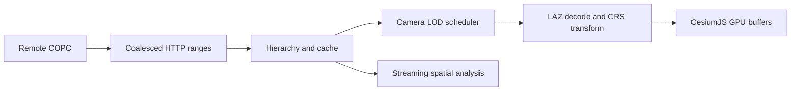

# CesiumJS COPC Runtime

Stream and analyse COPC point clouds directly in CesiumJS. No 3D Tiles conversion,
no preprocessing step, no second copy of your data.

[](https://github.com/yangseungsang/cesiumjs-copc-runtime/actions/workflows/ci.yml)
[](https://www.npmjs.com/package/cesiumjs-copc)
[](https://yangseungsang.github.io/cesiumjs-copc-runtime/)
[](LICENSE)
[](package.json)

**[Live demo](https://yangseungsang.github.io/cesiumjs-copc-runtime/)** |
[한국어](README.ko.md) |
[Getting started](docs/getting-started.md) |
[API reference](docs/api-reference.md) |
[Architecture](docs/architecture.md) |
[Benchmarks](docs/benchmarks.md) |
[Contributing](CONTRIBUTING.md)


<p align="center">
  <em>
    The public Autzen Stadium COPC (10,653,336 points, 77.4 MiB) opened straight from
    Amazon S3. This view is 1.5 M points across 45 octree nodes for 19 MB transferred.
  </em>
</p>

> This is an independent open-source project and is not an official Cesium project.

## Why

Most web point-cloud pipelines convert the source into a separate delivery format
first. That costs preprocessing time, duplicates storage, and leaves analysis working
against a different copy than the one you look at.

COPC already stores LAZ points in a range-addressable octree, so a browser can fetch
just the hierarchy pages and node chunks the current camera needs.

```text
Conventional:  source point cloud  ->  preprocessing  ->  service copy  ->  viewer
This project:  one COPC file  ------- HTTP byte ranges ------>  CesiumJS
                                  \-----------------------> streaming analysis
```

## What it looks like

Colour every point by its LAS attributes at runtime. Switching modes re-colours the
points already in memory and does not refetch anything.

|                              RGB                               |                                      Classification                                      |                                 Intensity                                  |
| :------------------------------------------------------------: | :--------------------------------------------------------------------------------------: | :------------------------------------------------------------------------: |
|  |  |  |

Filter by classification to isolate a surface. The filter runs against the decoded
points, so ground and buildings come out of the same single file.

|                             Ground only                              |                              Buildings only                              |
| :------------------------------------------------------------------: | :----------------------------------------------------------------------: |
|  |  |

Every layer reports what it actually did, so streaming behaviour is measurable rather
than assumed.


## Install

```sh
npm install cesiumjs-copc
```

CesiumJS comes along as a dependency. Add the analysis package only if you need
spatial queries, statistics, or height profiles:

```sh
npm install cesiumjs-copc-analysis
```

Requirements: Node.js 20 or newer to build, a WebGL-capable browser to run, and a COPC
source served with CORS enabled and HTTP `206 Partial Content` support.

## Quick start

```ts
import { Viewer } from "cesium";
import { CopcPointCloud } from "cesiumjs-copc";

const viewer = new Viewer("cesiumContainer");

const pointCloud = await CopcPointCloud.fromUrl(
  "https://s3.amazonaws.com/hobu-lidar/autzen-classified.copc.laz",
);

viewer.scene.primitives.add(pointCloud);
viewer.camera.flyToBoundingSphere(pointCloud.boundingSphere);
```

That is the whole integration. The layer fetches its own hierarchy, picks nodes for
the current camera, decodes LAZ in Workers, and keeps refining as you navigate.

### Checking a source first

`fromUrl` assumes the server cooperates. For an unfamiliar URL, ask first:

```ts
const diagnosis = await CopcPointCloud.validateUrl(url);
if (!diagnosis.supportsRanges) throw new Error("Server does not serve byte ranges");
if (!diagnosis.copcValid) throw new Error(diagnosis.error ?? "Not a valid COPC file");
```

### Tuning the defaults

Defaults adapt to a detected low, medium, or high device tier. Every one of them is
overridable:

```ts
import { IndexedDbRangeCache } from "cesiumjs-copc-core";

const pointCloud = await CopcPointCloud.fromUrl(url, {
  maximumScreenSpaceError: 2, // lower values request more detail
  pointBudget: 2_000_000, // ceiling on simultaneously visible points
  pointSize: 2,
  colorBy: "rgb", // "rgb" | "classification" | "intensity" | "elevation"
  filter: { classifications: [2] }, // ground only
  allowPicking: true,
  requestConcurrency: 8,
  sourceCrs: undefined, // required only when the file carries no CRS WKT
  range: {
    persistentCache: IndexedDbRangeCache.supported
      ? new IndexedDbRangeCache({ maximumBytes: 512 * 1024 * 1024 })
      : undefined,
  },
});
```

`colorBy`, `filter`, `pointSize`, `opacity`, `pointBudget`, and
`maximumScreenSpaceError` are also writable properties, so the demo's controls are
plain assignments after load.

See [Getting started](docs/getting-started.md) for the full walkthrough,
[Coordinate systems](docs/coordinate-systems.md) for CRS and geoid handling, and
[Troubleshooting](docs/troubleshooting.md) when a source misbehaves.

## Streaming analysis

Queries run in the source COPC CRS against the same file the viewer reads. Results
arrive as an async stream, so nothing has to be fully materialised first.

```ts
import { CopcSource } from "cesiumjs-copc-core";
import { computeStatistics, queryBounds } from "cesiumjs-copc-analysis";

const source = await CopcSource.fromUrl(url);
const nodes = queryBounds(source, [minX, minY, minZ, maxX, maxY, maxZ], {
  pointLimit: 2_000_000,
  dimensions: ["Intensity", "Classification"],
});

const statistics = await computeStatistics(nodes);
// { pointCount, height: { minimum, maximum, mean }, intensity, classifications }
```

`computeHeightProfile` is available from the same package for cross-section profiles.

## Run the demo locally

```sh
git clone https://github.com/yangseungsang/cesiumjs-copc-runtime.git
cd cesiumjs-copc-runtime
npm ci
npm run build
npm run demo
```

Open the printed URL. It loads the Autzen Stadium dataset and accepts any
CORS-enabled COPC URL that supports byte ranges. The screenshots above are captured
from this demo by `node scripts/capture-screenshots.mjs`.

## Features

**Networking**

- COPC header, VLR, and hierarchy pages loaded lazily through HTTP `206` ranges
- nearby range coalescing, plus compressed, decoded, and IndexedDB caches
- cancellation and reprioritisation when the camera changes

**Rendering**

- additive screen-space LOD with camera-centred priorities and point budgets
- transferable Worker-based LAZ decoding
- node-relative ECEF `Float32` render positions with source `Float64` coordinates kept
- RGB, classification, intensity, and elevation colouring; filters, opacity, and
  eye-dome lighting
- low, medium, and high device tiers with overridable budgets

**Geospatial and analysis**

- WKT compound CRS handling, explicit EGM96 correction, and common Korean EPSG grids
- picking, GPS-time to Cesium Clock binding, spatial queries, statistics, and profiles

## Packages

| Package                                            | Role                                                         |
| -------------------------------------------------- | ------------------------------------------------------------ |
| [`cesiumjs-copc`](packages/cesium-copc)            | Main CesiumJS rendering and interaction package              |
| [`cesiumjs-copc-core`](packages/copc-core)         | COPC source, range reader, hierarchy, cache, and point types |
| [`cesiumjs-copc-runtime`](packages/copc-runtime)   | LOD selection, request queue, device tiers, and memory cache |
| [`cesiumjs-copc-worker`](packages/copc-worker)     | Browser Worker pool, LAZ decode, and render coordinates      |
| [`cesiumjs-copc-analysis`](packages/copc-analysis) | Bounds queries, statistics, and height profiles              |
| [`cesiumjs-copc-benchmark`](packages/benchmark)    | Reproducible remote streaming and decode benchmark           |

Most applications only need `cesiumjs-copc`, which pulls in the rest.

## Architecture



Networking, scheduling, decoding, rendering, and analysis are separate packages so
they can evolve independently. See [Architecture](docs/architecture.md) and
[ADR-0001](docs/adr/0001-native-copc-runtime.md) for the reasoning.

## Measured results

| Evidence                                 |                                       Current result |
| ---------------------------------------- | ---------------------------------------------------: |
| Automated unit tests                     |                             58 tests across 15 files |
| Coverage baseline                        | 50.95% statements, 74.01% branches, 81.04% functions |
| Supported CI runtimes                    |                                    Node.js 20 and 22 |
| Browser verification                     |                           Chromium viewer smoke test |
| Reference COPC                           |                         10,653,336 points / 77.4 MiB |
| Bytes transferred for the benchmark view |                                        about 3.0 MiB |
| Points decoded                           |                        269,241 across 8 octree nodes |
| Median decode throughput, three runs     |                                about 55,875 points/s |

These are observations from one machine, not portable performance claims. Read
[the benchmark methodology](docs/benchmarks.md) before comparing them to another
environment.

Every pull request runs formatting, lint, the unit tests, coverage thresholds,
TypeScript checks, all workspace builds, package dry-runs, and a Chromium smoke test:

```sh
npm run lint
npm run format:check
npm test
npm run test:coverage
npm run typecheck
npm run build
npm run demo:build
npm run test:e2e
```

## Project status

A working `0.1.0` MVP. Known limitations:

- Cesium's buffer point API is still experimental
- colour and filter updates are applied CPU-side at runtime
- geoid correction is explicit-only
- long-duration browser benchmarks are incomplete

These are tracked in
[Issues](https://github.com/yangseungsang/cesiumjs-copc-runtime/issues) and the
[roadmap](docs/roadmap.md).

## Contributing

Read [CONTRIBUTING.md](CONTRIBUTING.md) before opening a pull request, and use the
structured issue forms for bugs, features, and performance reports. Suspected
vulnerabilities must be reported privately per [SECURITY.md](SECURITY.md).

Released under the [MIT License](LICENSE).
